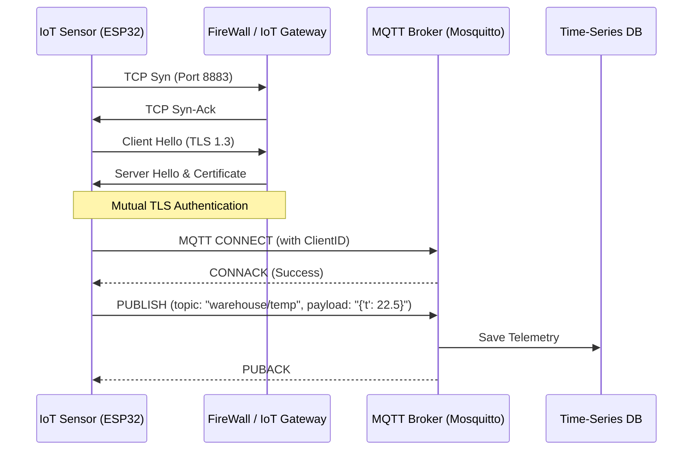
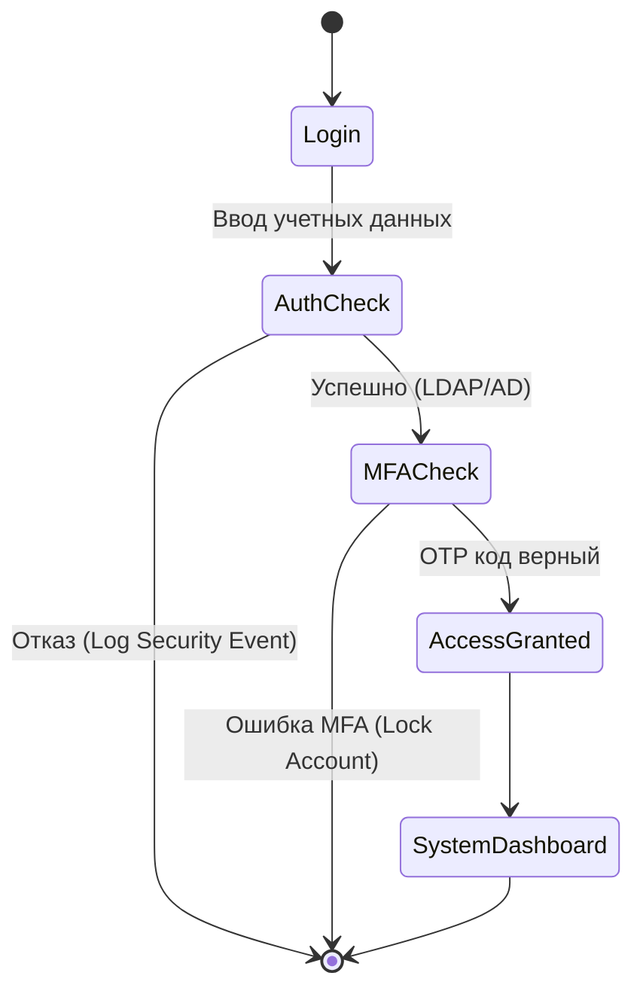

# Архитектурные диаграммы проекта

В данном разделе представлены ключевые модели взаимодействия компонентов системы с акцентом на сетевую безопасность и процессы Industry 4.0.

## 1. Sequence Diagram: Передача данных от датчика (IoT) на сервер
Эта диаграмма показывает процесс установления защищенного соединения (TLS Handshake) и передачу телеметрии по протоколу MQTT. Это закрывает требование вакансии по пониманию **стека TCP/IP и TLS**.

## 2. Activity Diagram: Проверка доступа к управлению складом
Диаграмма процесса (BPMN-style), описывающая логику авторизации пользователя с учетом требований ИБ.

## 3. Network Map (Логическая схема сети)
Описание сегментации сети для защиты критической инфраструктуры склада (согласно рекомендациям **ФСТЭК**).

*   **External Zone:** Интернет, мобильное приложение оператора.
*   **DMZ (Демилитаризованная зона):** Reverse Proxy, VPN Gateway.
*   **Internal IoT Zone (VLAN 10):** Изолированный сегмент для датчиков, доступ только к MQTT-брокеру.
*   **Management Zone (VLAN 20):** Серверы приложений, БД, WMS-интеграция.

> **Примечание по СЗИ:** Между всеми зонами установлен Межсетевой экран (L7 Firewall) с правилами фильтрации трафика по "белым спискам" IP/MAC-адресов.
